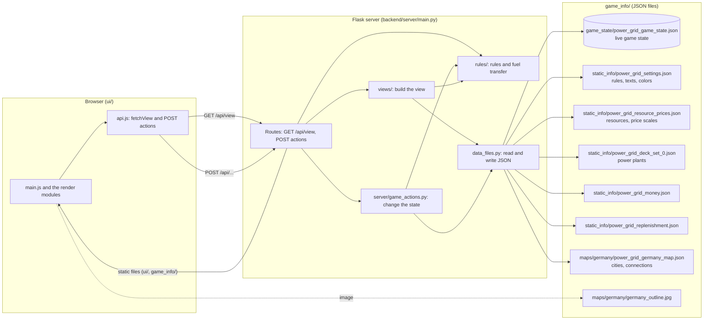

# System overview

How the browser, the Flask server, and the JSON files connect.

```mermaid
flowchart LR
    subgraph Browser["Browser (ui/)"]
        UI["main.js and the render modules"]
        API["api.js: fetchView and POST actions"]
        UI --> API
    end

    subgraph Server["Flask server (backend/server/main.py)"]
        Routes["Routes: GET /api/view, POST actions"]
        Views["views/: build the view"]
        Actions["server/game_actions.py: change the state"]
        Rules["rules/: rules and fuel transfer"]
        Data["data_files.py: read and write JSON"]
        Routes --> Views
        Routes --> Actions
        Routes --> Rules
        Views --> Data
        Actions --> Data
        Actions --> Rules
        Views --> Rules
    end

    subgraph Files["game_info/ (JSON files)"]
        State[("game_state/power_grid_game_state.json<br/>live game state")]
        Settings["static_info/power_grid_settings.json<br/>rules, texts, colors"]
        Resources["static_info/power_grid_resource_prices.json<br/>resources, price scales"]
        Deck["static_info/power_grid_deck_set_0.json<br/>power plants"]
        Money["static_info/power_grid_money.json"]
        Replen["static_info/power_grid_replenishment.json"]
        Map["maps/germany/power_grid_germany_map.json<br/>cities, connections"]
        Outline["maps/germany/germany_outline.jpg"]
    end

    API -- "GET /api/view" --> Routes
    API -- "POST /api/..." --> Routes
    Routes -- "static files (ui/, game_info/)" --> UI
    Data --> State
    Data --> Settings
    Data --> Resources
    Data --> Deck
    Data --> Money
    Data --> Replen
    Data --> Map
    UI -. "image" .-> Outline
```

[Back to index](../README.md)
