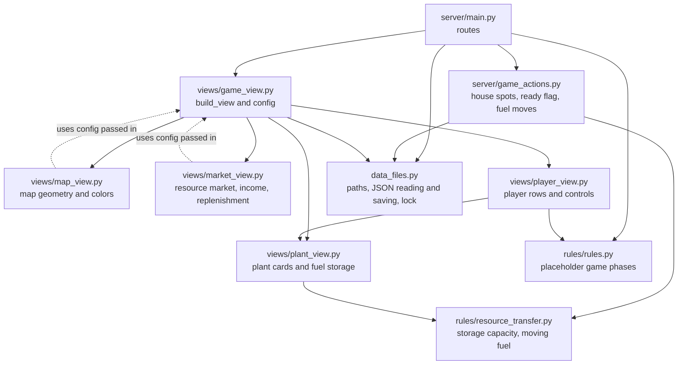

# Backend modules

Which backend Python module uses which.

```mermaid
flowchart TD
    main["server/main.py<br/>routes"]
    actions["server/game_actions.py<br/>house spots, ready flag, fuel moves"]
    gview["views/game_view.py<br/>build_view and config"]
    mview["views/map_view.py<br/>map geometry and colors"]
    mkt["views/market_view.py<br/>resource market, income, replenishment"]
    pview["views/player_view.py<br/>player rows and controls"]
    plview["views/plant_view.py<br/>plant cards and fuel storage"]
    data["data_files.py<br/>paths, JSON reading and saving, lock"]
    rules["rules/rules.py<br/>placeholder game phases"]
    xfer["rules/resource_transfer.py<br/>storage capacity, moving fuel"]

    main --> actions
    main --> gview
    main --> rules
    main --> data

    actions --> data
    actions --> xfer

    gview --> data
    gview --> mview
    gview --> mkt
    gview --> pview
    gview --> plview

    pview --> plview
    pview --> rules
    plview --> xfer

    mview -. "uses config passed in" .-> gview
    mkt -. "uses config passed in" .-> gview
```

[Back to index](../README.md)
