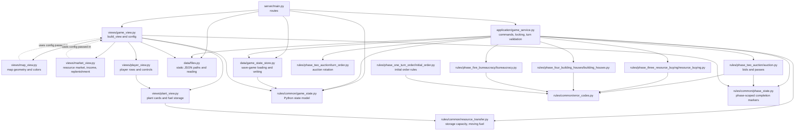

# Backend modules

Which backend Python module uses which.

```mermaid
flowchart TD
    main["server/main.py<br/>routes"]
    service["application/game_service.py<br/>commands, locking, turn validation"]
    gview["views/game_view.py<br/>build_view and config"]
    mview["views/map_view.py<br/>map geometry and colors"]
    mkt["views/market_view.py<br/>resource market, income, replenishment"]
    pview["views/player_view.py<br/>player rows and controls"]
    plview["views/plant_view.py<br/>plant cards and fuel storage"]
    data["data/files.py<br/>static JSON paths and reading"]
    store["data/game_state_store.py<br/>save-game loading and writing"]
    state["rules/common/game_state.py<br/>Python state model"]
    errors["rules/common/error_codes.py"]
    phaseState["rules/common/phase_state.py<br/>phase-scoped completion markers"]
    initial["rules/phase_one_turn_order/initial_order.py<br/>initial order rules"]
    auction["rules/phase_two_auction/auction.py<br/>bids and passes"]
    turn["rules/phase_two_auction/turn_order.py<br/>auction rotation"]
    resources["rules/phase_three_resource_buying/resource_buying.py"]
    houses["rules/phase_four_building_houses/building_houses.py"]
    bureau["rules/phase_five_bureaucracy/bureaucracy.py"]
    xfer["rules/common/resource_transfer.py<br/>storage capacity, moving fuel"]

    main --> gview
    main --> service
    main --> data
    main --> store
    main --> state

    service --> state
    service --> phaseState
    service --> data
    service --> store
    service --> turn
    service --> auction
    service --> resources
    service --> houses
    service --> bureau
    service --> xfer
    store --> state
    auction --> phaseState
    auction --> errors
    resources --> errors
    houses --> errors
    bureau --> errors
    initial --> errors
    gview --> data
    gview --> state
    gview --> phaseState
    gview --> mview
    gview --> mkt
    gview --> pview
    gview --> plview

    pview --> plview
    plview --> xfer

    mview -. "uses config passed in" .-> gview
    mkt -. "uses config passed in" .-> gview
```

[Back to documentation](../index.md)
