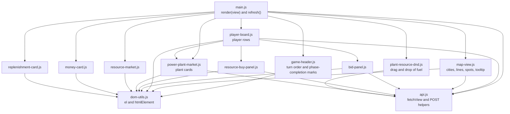

# Frontend modules

Which browser JavaScript module uses which.

```mermaid
flowchart TD
    main["main.js<br/>render(view) and refresh()"]
    api["api.js<br/>fetchView and POST helpers"]
    dom["dom-utils.js<br/>el and htmlElement"]

    header["game-header.js<br/>turn order and phase-completion marks"]
    map["map-view.js<br/>cities, lines, spots, tooltip"]
    board["player-board.js<br/>player rows"]
    bid["bid-panel.js"]
    buy["resource-buy-panel.js"]
    plants["power-plant-market.js<br/>plant cards"]
    dnd["plant-resource-dnd.js<br/>drag and drop of fuel"]
    market["resource-market.js"]
    money["money-card.js"]
    repl["replenishment-card.js"]

    main --> header
    main --> map
    main --> board
    main --> plants
    main --> market
    main --> money
    main --> repl
    main --> dnd
    main --> api

    board --> bid
    board --> buy
    board --> plants
    board --> api

    map --> api
    bid --> api
    buy --> api
    plants --> api
    dnd --> api

    header --> dom
    map --> dom
    board --> dom
    bid --> dom
    buy --> dom
    plants --> dom
    market --> dom
    money --> dom
    repl --> dom
```

[Back to documentation](../index.md)
