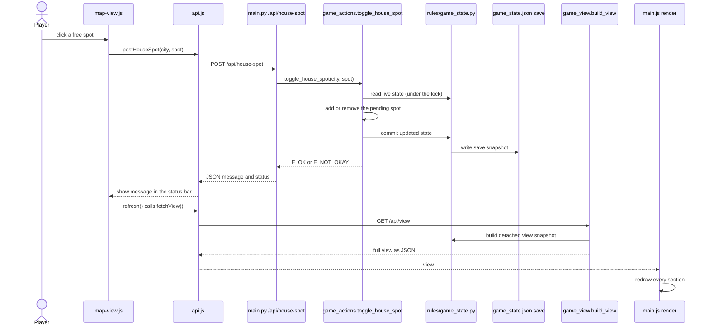

# Click a house spot

What happens from the click to the redraw.

```mermaid
sequenceDiagram
    actor Player
    participant Map as map-view.js
    participant Api as api.js
    participant Route as main.py /api/house-spot
    participant Actions as game_actions.toggle_house_spot
    participant State as rules/game_state.py
    participant Save as game_state.json save
    participant View as game_view.build_view
    participant Page as main.js render

    Player->>Map: click a free spot
    Map->>Api: postHouseSpot(city, spot)
    Api->>Route: POST /api/house-spot
    Route->>Actions: toggle_house_spot(city, spot)
    Actions->>State: read live state (under the lock)
    Actions->>Actions: add or remove the pending spot
    Actions->>State: commit updated state
    State->>Save: write save snapshot
    Actions-->>Route: E_OK or E_NOT_OKAY
    Route-->>Api: JSON message and status
    Api-->>Map: show message in the status bar
    Map->>Api: refresh() calls fetchView()
    Api->>View: GET /api/view
    View->>State: build detached view snapshot
    View-->>Api: full view as JSON
    Api-->>Page: view
    Page->>Page: redraw every section
```

[Back to index](../README.md)
