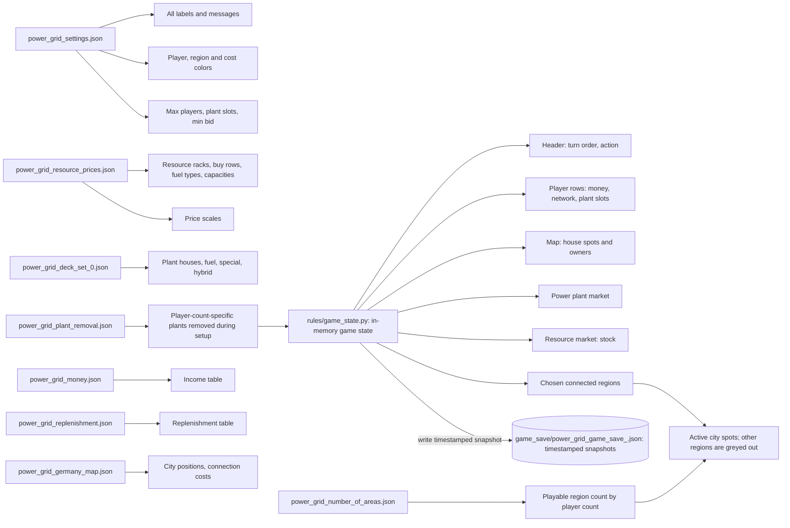

# Data sources

Which JSON file feeds which part of the screen.

```mermaid
flowchart LR
    State["rules/game_state.py: in-memory game state"]
    Saves[("game_save/power_grid_game_save_<timestamp>.json: timestamped snapshots")]
    Settings["power_grid_settings.json"]
    Resources["power_grid_resource_prices.json"]
    Areas["power_grid_number_of_areas.json"]
    Deck["power_grid_deck_set_0.json"]
    Removal["power_grid_plant_removal.json"]
    Money["power_grid_money.json"]
    Replen["power_grid_replenishment.json"]
    Map["power_grid_germany_map.json"]

    State --> Header["Header: turn order, action"]
    State --> Players["Player rows: money, network, plant slots"]
    State --> Houses["Map: house spots and owners"]
    State --> MarketCards["Power plant market"]
    State --> RMarket["Resource market: stock"]

    Settings --> Texts["All labels and messages"]
    Settings --> Colors["Player, region and cost colors"]
    Settings --> Limits["Max players, plant slots, min bid"]
    Areas --> ActiveRegions["Playable region count by player count"]
    State --> ChosenRegions["Chosen connected regions"]
    ActiveRegions --> PlayableCities["Active city spots; other regions are greyed out"]
    ChosenRegions --> PlayableCities

    Resources --> Racks["Resource racks, buy rows, fuel types, capacities"]
    Resources --> Scales["Price scales"]

    Deck --> PlantInfo["Plant houses, fuel, special, hybrid"]
    Removal --> Removed["Player-count-specific plants removed during setup"]
    Removed --> State
    Money --> Income["Income table"]
    Replen --> Rates["Replenishment table"]
    Map --> Geometry["City positions, connection costs"]
    State -->|write timestamped snapshot| Saves
```

[Back to documentation](../index.md)
